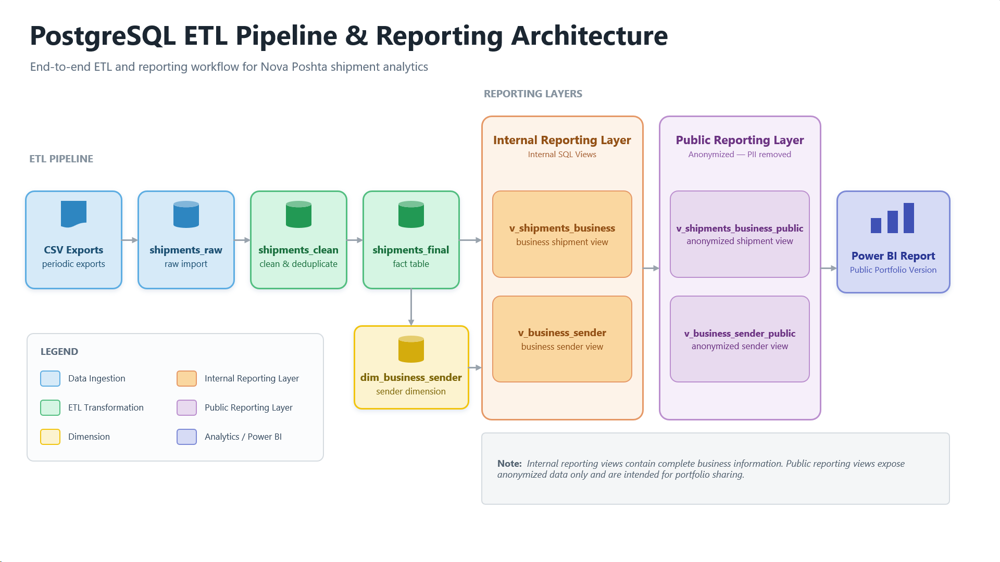
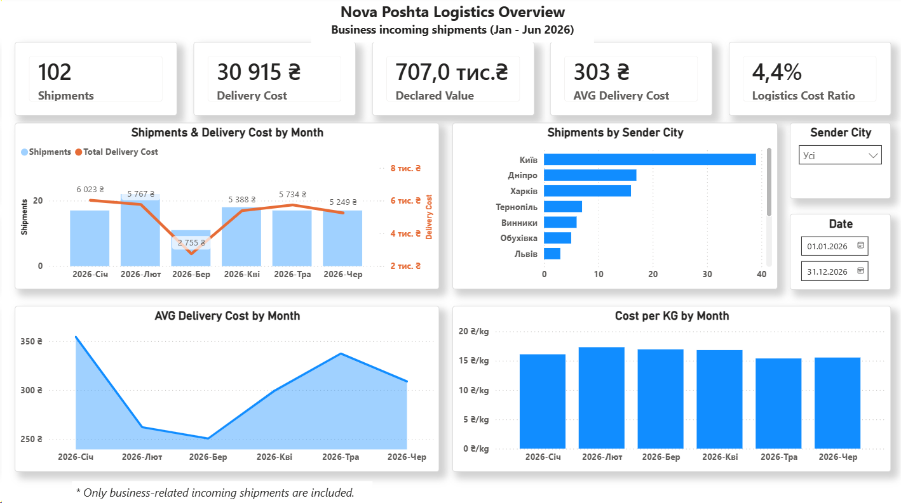
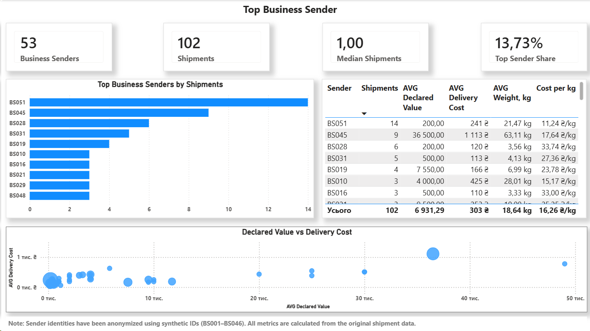
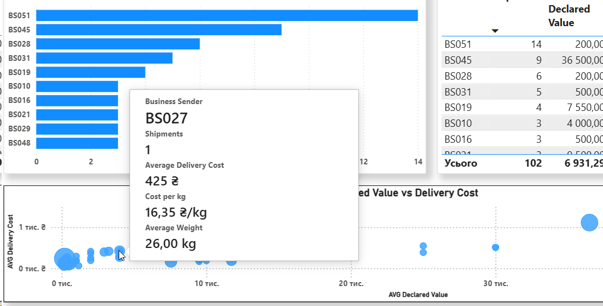

# Nova Poshta Business Shipments Analytics

## Project Overview

This project demonstrates a complete data analytics workflow using real shipment data exported from Nova Poshta. The public version of this project uses anonymized reporting views to remove personally identifiable sender information while preserving the analytical model.

The project includes the following components:

- data preparation and cleansing
- ETL pipeline in PostgreSQL
- incremental database updates
- dimensional modeling
- analytical reporting in Power BI

The solution transforms raw shipment exports into a structured analytical dataset designed for business reporting and operational analysis.

## Business Problem

Nova Poshta shipment exports are generated as periodic CSV files containing overlapping historical data, ensuring continuity of the shipment history.

The objective of this project is to:

- consolidate multiple exports into a single historical dataset
- eliminate duplicate shipment records
- classify business and personal shipments
- build a reusable ETL process
- support incremental updates without rebuilding the entire database
- provide an analytical dataset for Power BI dashboards

## Technology Stack

- PostgreSQL
- SQL
- Power BI
- DAX
- Git
- GitHub

## Project Structure

```text
Nova_Poshta_Analytics/
│
├── sql/
│   ├── 01_create_schema.sql
│   ├── 02_prepare_data.sql
│   ├── 03_create_dimensions.sql
│   ├── 04_create_views.sql
│   └── 05_update_database.sql
│
├── powerbi/
│   └── Nova_Poshta_Logistics_Analytics.pbix
│
├── images/
│
├── README.md
│
└── LICENSE
```

### SQL Scripts

| Script                        | Description                                           |
|-------------------------------|-------------------------------------------------------|
| `01_create_schema.sql`        | Creates the database schema and tables                |
| `02_prepare_data.sql`         | Cleans historical shipment data and transforms it into an analytical model  |
| `03_create_dimensions.sql`    | Builds and populates the business sender dimension    |
| `04_create_views.sql`         | Creates internal and public reporting views for analytical reporting.  |
| `05_update_database.sql`      | Performs incremental updates by inserting only new shipment records and updating dimensions  |

## ETL Pipeline



The ETL pipeline separates raw data ingestion, data cleansing, transformation, and reporting into independent stages. This layered approach simplifies maintenance, improves data quality, and supports incremental updates without rebuilding the entire dataset.

The analytical model stores all cleaned shipments in 'shipments_final' (126 records). The Power BI dashboard is built on 'v_shipments_business', which filters the dataset to 102 business-related incoming shipments.

The reporting layer is separated into internal and public SQL views. Internal views expose full business information, while public views anonymize sender identities for the portfolio version of the Power BI report.

## Power BI Dashboard

The Power BI report consists of two report pages.

### Overview

The Overview page presents:

- shipment KPIs
- delivery costs
- declared value analysis
- shipment type distribution
- interactive filtering



### Business Senders

The Business Senders page focuses on:

- shipment activity by sender
- delivery costs
- sender ranking
- shipment trends



The repository contains the public Power BI report built on anonymized SQL views. A separate internal report uses the corresponding internal views with real sender identities.

The report also uses a custom tooltip page to display additional sender metrics without overcrowding the main dashboard.


Custom tooltip displaying additional sender metrics on hover.

### Data Model

The Power BI model uses a dedicated `Created_Date` column derived from the `created_at` timestamp to establish the relationship between the fact table and the calendar dimension.

```
Fact_shipments[Created_Date] → Dim_Date[Date]
```

This date-only column enables correct time-based filtering and aggregation because the source shipment timestamp includes both date and time components.

Note: When rebuilding the Power BI model from scratch, recreate the Created_Date calculated column before linking the fact table to the calendar dimension.

## Business Insights

Analysis of business incoming shipments (January–June 2026) revealed several operational patterns:

- A small number of suppliers account for a disproportionately large share of shipments, indicating supplier concentration
- Delivery costs remain relatively stable despite fluctuations in shipment volume
- Most shipments are delivered within 1–2 days, suggesting consistently fast logistics performance
- Delivery cost per kilogram shows only minor monthly variation
- Most business shipments originate from a limited number of cities, primarily Kyiv and Kharkiv

### Potential Business Actions

Based on these findings, the company could consider:

- reducing supplier dependency by diversifying sources for key product categories to minimize the impact of supply delays
- negotiating better delivery rates with Nova Poshta as shipment volumes grow
- using stable logistics costs to improve budgeting and cost forecasting
- identifying suppliers with unusually high delivery cost per kilogram and investigating opportunities to optimize shipping
- extending supplier analytics by introducing supplier mapping and additional supplier performance indicators

## Incremental Updates

The project supports incremental loading of new Nova Poshta exports.

Instead of rebuilding the database, the update process:

- imports new shipment exports into the staging table
- inserts only new shipment numbers into the historical dataset
- transforms only newly added records
- updates the business sender dimension

This approach preserves historical data while allowing the analytical model to grow over time.

## Data Privacy

The repository contains only anonymized reporting views.

Business sender names and phone numbers remain available only in the internal reporting layer and are excluded from the public Power BI report.

The public dashboard replaces sender identities with synthetic identifiers (BS001, BS002, ...), allowing the analytical model to be shared without exposing personal information.

## Validation

The ETL pipeline was validated using both the initial historical dataset and a subsequent shipment export.

| Stage                       | Initial   | After Update  |
|-----------------------------|-----------|---------------|
| shipments_clean             | 110       | 126           |
| shipments_final             | 110       | 126           |
| business_senders            | 46        | 53            |
| v_shipments_business        | 88        | 102           |

The successful validation confirms that the incremental ETL process preserves historical data while importing only newly detected shipments.

## Future Improvements

Future development may include:

- publishing the report to Power BI Service
- creating an interactive PowerPoint presentation
- designing a mobile-optimized Power BI report layout
- mapping multiple shipment senders to actual suppliers using additional business reference data provided by the company
- redesigning the incremental loading process to use database constraints (`UNIQUE`) and conflict handling (`ON CONFLICT`) for more efficient data ingestion
- automating CSV import and ETL execution
- adding geographic analysis of shipment destinations